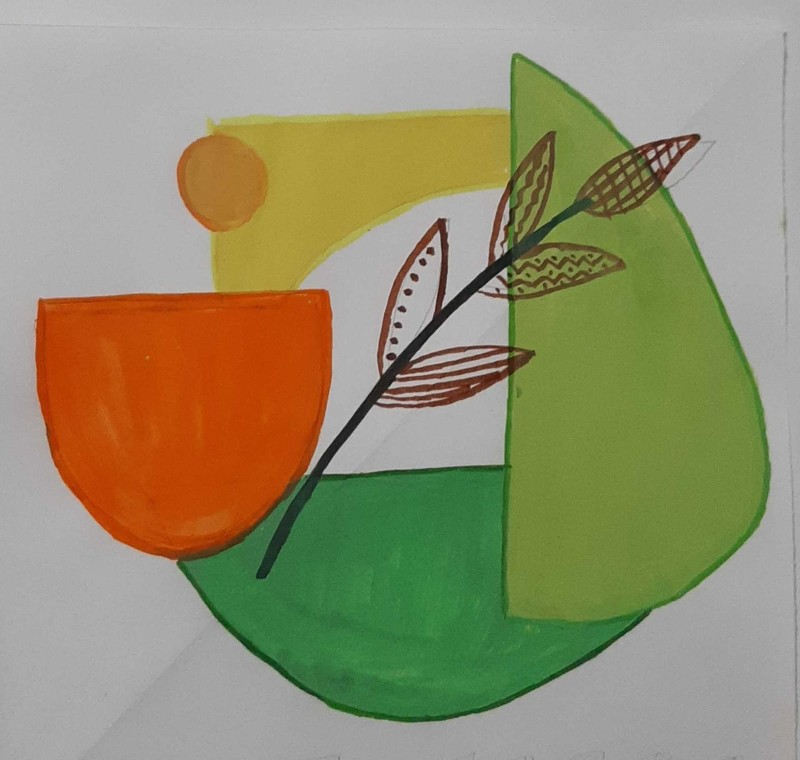
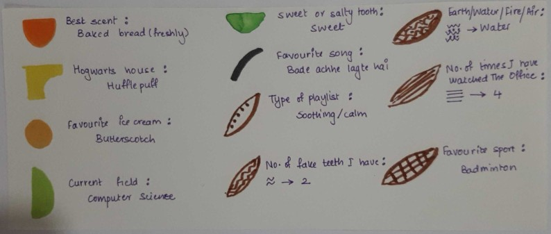

# Data-Viz-with-IIP
As part of my weekly tasks during the workshop, I created graphs  using p5.Js with different concepts each week.  

## Week 1: Data Portrait

Challenge: You have made an alien friend from Mars. They are curious about your life. The catch is - they don't understand human text but do understand numbers, shapes, geometry, colors, symbols, and signs. Create a data portrait that helps your alien friend, understand some aspect of your life - (ex. friendship / music taste/ personality / 'habits / relationships / ambition). 

I made a data portrait highlighting a few things about me along with a key for reading it.

Data Portrait:  

Key:  

## Week 2:Custom emoji

Challenge: Design and code in p5 a new emoji that does not exist in standard keyboards.

I based the emoji challenge on a "one-man army" character.
1. He was known for getting himself into the strangest of situations.
2. He usually tends to exhibit childish characteristics even though he is considered to be a 20-year-old adult.  

These two things resonate with me a lot :p

[Code in p5.js](https://editor.p5js.org/shubhangi318/full/4pYg4ODQN)

Week 3: Static and motion graphs from bollywood dataset containing information like actor, director, music director, rating etc. for roughly 200 movies  

Week 4: Graph depicting city's current weather using live API  

Week 5: Finding principles of design in paintings/artworks  
