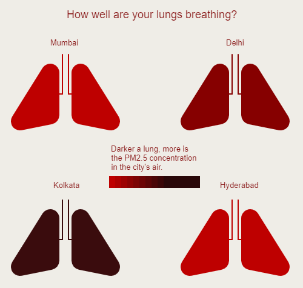

# Data-Viz-with-IIP
As part of my weekly tasks during the workshop, I created graphs  using p5.Js with different concepts each week.  

## Week 1: Data Portrait

Challenge: You have made an alien friend from Mars. They are curious about your life. The catch is - they don't understand human text but do understand numbers, shapes, geometry, colors, symbols, and signs. Create a data portrait that helps your alien friend, understand some aspect of your life - (ex. friendship / music taste/ personality / 'habits / relationships / ambition). 

I made a data portrait highlighting a few things about me along with a key for reading it.

Data Portrait:  

Key:  

*******************

## Week 2: Custom emoji

Challenge: Design and code in p5 a new emoji that does not exist in standard keyboards.

I based the emoji challenge on a "one-man army" character.
1. He was known for getting himself into the strangest of situations.
2. He usually tends to exhibit childish characteristics even though he is considered to be a 20-year-old adult.  

These two things resonate with me a lot :p

[Code in p5.js](https://editor.p5js.org/shubhangi318/full/4pYg4ODQN)

*******************

## Week 3: Bollywood story

Challenge: Using the bollywood dataset, create two p5js visualizations - one png and one gif showing an interesting insight about Bollywood.

.png)

For the static assignment, I tried to visualize the profitability of directors when they cast Shah Rukh Khan in the lead role.

[Code in p5.js](https://editor.p5js.org/shubhangi318/full/7gT1yPoA0)

*******************

.gif)

For the motion assignment, I created a barchart gif that shows the profitability of 5 star kids vs outsiders.

[Code in p5.js](https://editor.p5js.org/shubhangi318/full/d4PIQj_ed)

*******************

## Week 4:PM2.5 pollution in the air using live API

Challenge: Use a city's live weather data (pollution/forecast/current) to create a p5js sketch.

I visualized the PM2.5 concentration level in four metropolitan cities:
1. Mumbai
2. Delhi
3. Hyderabad
4. Kolkata

This snap is taken on 22 August 2022, at 14:34 IST. The lungs change color depending on the current pollution in the city's air.

[Code in p5.js](https://editor.p5js.org/shubhangi318/full/hOv_ejURE)

*******************

## Week 5: Finding design in artwork

Challenge: Pick an artwork from any artist that you like. Write a one page write-up on the different design principles you see in the artwork.

Open week 5 to find the presentation.

