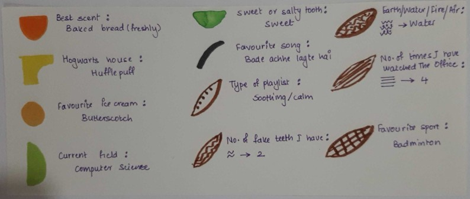

# Week 1:Data Portrait

Challenge: You have made an alien friend from Mars. They are curious about your life. The catch is - they don't understand human text but do understand numbers, shapes, geometry, colors, symbols, and signs. Create a data portrait that helps your alien friend, understand some aspect of your life - (ex. friendship / music taste/ personality / 'habits / relationships / ambition).

 
I made a data portrait highlighting a few things about me along with a key for reading it.

Data Portrait:  

Key:  

