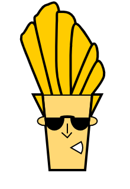

# Week 1:Custom emoji

Challenge: Design and code in p5 a new emoji that does not exist in standard keyboards.

I based the emoji challenge on a "one-man army" character.
1. He was known for getting himself into the strangest of situations.
2. He usually tends to exhibit childish characteristics even though he is considered to be a 20-year-old adult.  
These two things resonate with me a lot :p

[Code in p5.js](https://editor.p5js.org/shubhangi318/full/4pYg4ODQN)

