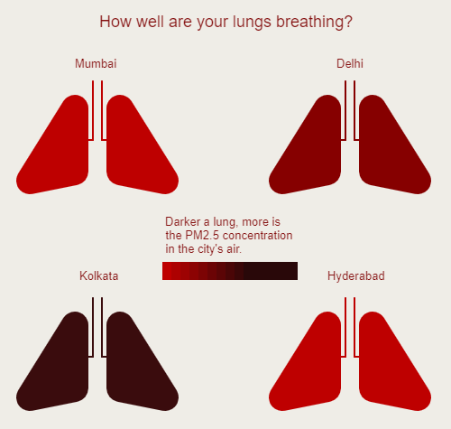

# Week 4:PM2.5 pollution in the air using live API

Challenge: Use a city's live weather data (pollution/forecast/current) to create a p5js sketch.

I visualized the PM2.5 concentration level in four metropolitan cities:
1. Mumbai
2. Delhi
3. Hyderabad
4. Kolkata

This snap is taken on 22 August 2022, at 14:34 IST. The lungs change color depending on the current pollution in the city's air.

[Code in p5.js](https://editor.p5js.org/shubhangi318/full/hOv_ejURE)
